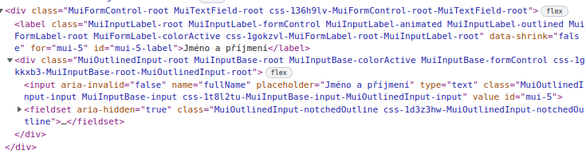
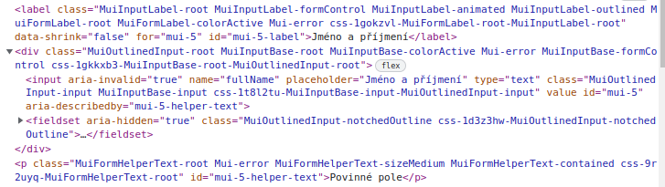

Wai-aria (aria standing for Accessible Rich Internet Applications) is a way to describe unclear parts of our web application to people with disabilities. It is defined on [w3.org site](https://www.w3.org/TR/wai-aria/) and is currently in version 1.1 from the year 2017.

It defines how the website should be structured and what practices and features are recommended and which are not. This became more needed as we use less of html and more JavaScript, which often uses `div`'s and other generic elements to do more than just style the website. The problem with this is that screen, readers and other assistive technologies, can hardly recognize what is the real usage of such generic element without help.

## Rules

There are multiple ways to achieve accessibility on our website, but the easiest one is to use native html elements which are intended for the feature we are implementing. So this is one of the first rules we should always follow.

- If there is native html element with the features we need, use it

This means for example that if we want to make a progress bar, we can make it from `
` and update the `aria-valuenow` with JS, but there is already existing element for this, and that is `<progress value="50" max="100">` which is far more clearer and is using native html element.

If there is no native element, we can start using `role` attribute for more transparency of what is going on on our website. Role attribute has predefined values, which are descriptive and assistive technologies know them, and have more information from them than just the name. For all the roles and their definitions and what they are used for, go to [mdn web docs](https://developer.mozilla.org/en-US/docs/Web/Accessibility/ARIA/Roles#aria_role_types) where you can find more information, along with HTML elements that were introduced to replace the need of some roles.

Aria also specifies that there should not be any distinction between what normal user sees and what user with assistive technology sees. This means that we should not hide some elements with `visibility: hidden` and then apply role to it or other things that may show it to assistive technology but not being visible on normal browser or vice-versa.

- Do not distinguish between normal user and user with assistive technology

The same principle applies to menus and navigating our website. That means that you should be able to navigate anywhere on the website with assistive technology, normal mouse and keyboard and with the use of the inner browser selector (usually it is `tab` key to switch between elements). With this that also means that you should not be able to access some hidden parts of the site with `tab` key for example. So menus should use `tab-index` to hide their content before it is shown (looking at [ASWA](https://aswa.cz/) web for example where we can go with `tab` into menu which is folded).

- Every part of the website should be accessible for normal user, assistive technologies and only keyboard users

### Forms

Forms have some simple rules which are needed to be followed. This includes how to label them and how to show errors.

Most of this is even described on official [react documentation](https://reactjs.org/docs/accessibility.html#accessible-forms) which is really useful and simple.

There are two good sites for it one is [webaim.com](https://webaim.org/techniques/formvalidation/) and the second one is [w3.org](https://www.w3.org/WAI/tutorials/forms/notifications/). Both of them provide information on how to show feedback to users after submitting or validating a form along with information from react documentation where there are links to how to build a proper form.

All of it comes own to again using good html elements.

- input should have proper name and id
- input should have associated label - `<label for=[id_of_input]>`
- input should have associated error or success description using - `aria-describedby=[id_of_the_element]`
- we can also use `role=”alert”` to alert the assistive technology about newly created alert, or use javascript alert of confirmation functions
- use `aria-invalid=”true”` on invalid form controls
- provide descriptive information on how to fix the error which occurred

### Formik

Does Formik library have forms accessability in mind?

It sort of does, as long as we provide all information Formik needs for it. Formik uses labels and tags as it should, so it follows the aria specification in this extend.

Here we can see that formik uses `aria-invalid` which is one of the specifications for forms. Also it has associated label with the input. Which is again required for the aria. Along with using `aria-hidden=true` on fieldset element, which is used here for the text inside the input, so we do not want assistive technology to read it when there is already label for that. 

If we try to submit the form with data which doesn’t go through validation, we can see that the input has tag `aria-describedby=id`, which is again something the aria specifies. It indicates by which element is the error described by. On the last line we can `
` with id which corresponds to the `aria-describedby` value.

### Material UI (MUI)

With mui there are problems, because it does use generic elements like `div`s for it to make other elements which have native support in html. Example of this is `AppBar` or `ToolBar` which are usually used for navigation bars, but they use `div` instead of the native `nav` intended for this use.

We can change this behavior by changing the component which is used, but that is temporary solution which doesn’t scale well.

## Libraries

eslint packages for react:

- [https://github.com/jsx-eslint/eslint-plugin-jsx-a11y](https://github.com/jsx-eslint/eslint-plugin-jsx-a11y)
    - static checking during writing
    - It is already in eslint-airbnb config, so we just need some adjustements

Testing package:

- [https://github.com/dequelabs/axe-core-npm/tree/develop/packages/react](https://github.com/dequelabs/axe-core-npm/tree/develop/packages/react)
