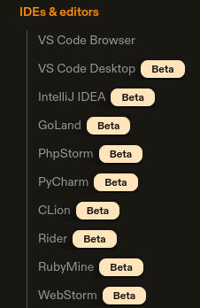
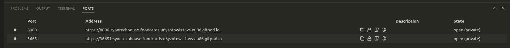

Almost 2 years back a colleague from our web department posted a message on our Slack channel about an emerging cloud-based development environment called GitPod. Back then we just quickly checked the GitPod concept, subscribed to a newsletter, and didn’t deep dive into it, after all, it was still in alpha anyway.

But things have changed and the GitPod team has made huge progress with their product since then so we finally decided to properly test this tool. But let’s get back for a moment and start with a little introduction to GitPod.

## What is GitPod?

GitPod is a cloud development environment and cloud IDE at once. That means you don’t edit the project files locally on your disk and don’t build the app on localhost but you edit all your files via web IDE (web version of VSCode) directly in the cloud storage and you also build the app in the cloud as well.

## What did we expect from GitPod?

GitPod tries to solve many software development problems, but from our point of view, there were  2 big features why we were so excited about it.

**1)** **Elimination of the “It works on my machine” problem**

You know that situation, sometimes the code works on your machine, but not on your colleague’s machine. At least in web development, there exist parts of your web app which are dependent on technologies installed locally on your machine, typically Git and Node. We ran into these issues a couple of times too. 

GitPod solves this because all developers work simply in the same cloud environment with the same shared “settings”.

**2) Easier context switching**

You know this too for sure. Imagine yourself working on a feature when suddenly somebody asks you to do a code review. The amount of manual work for a developer in this scenario is uncomfortably high. The developer has to do the following:

- back up his work by some kind of “WIP” commit or something like this,
- pull new changes,
- switch the branch,
- reinstall dependencies,
- rebuild the app,
- potentially clear the cache,

And the same when he switches back into his own feature branch. This consumes a lot of time but fortunately, GitPod has a solution.

What GitPod does is that it runs a separate environment for each branch and that’s why there is no need to do anything in your current environment, you just switch yourself into another, and properly set up the environment.

## Did GitPod satisfy our expectations?

Yes and no. GitPod is awesome in some aspects and definitely solves the points mentioned above but there still exist some difficulties, which convinced us to not replace our current development workflow at the moment.

## GitPod gotchas

**1) Price is too high**

In the current GitPod pricing model, the price depends on the number of hours you spent in GitPod, respectively the number of hours during which the workspaces are active. Workspaces are shut down after 60 minutes of inactivity, but you can stop them also manually. You need to bare this in mind, otherwise, you are paying unnecessarily for more hours than you really need. 

GitPod price starts growing rapidly when working more than 25 hours per week and wanting to work in a team ([https://www.gitpod.io/pricing](https://www.gitpod.io/pricing)). We considered a “plan” with 3 team members and 35 hours per week which costs approx. 54€ per member per month and that’s a lot. You can compare the price for example with the paid IDE Webstorm where the price is only 16$ per month. I know, Webstorm is just an IDE, but still.

**2) Desktop IDEs are still in Beta**

GitPod uses as a default IDE the web version of VSCode called VS Code Browser. This environment works pretty well but because it runs in a browser it inherently suffers by one problem:

- Most of the keyboard shortcuts known from your desktop IDE trigger browser actions instead of IDE actions.

If you don’t like this, you can of course use GitPod also in your favorite IDE, but there is a catch. Look at the screenshot below:

GitPod IDE support

There doesn’t exist any desktop IDE which isn’t in beta at the moment. We didn’t dive deep into researching all of the IDEs, but we have tried at least VS Code Desktop as one of the most used IDE for web development.

**3) VS Code Desktop BETA**

When using GitPod with VS Code you have to count with a little bit of annoying configuration at the beggining. Except the fact, that you will need to install GitPod plugin, which is logical, you will face two main issues:

a) GitPod can’t synchronize your editor settings via GitHub, because Microsoft doesn’t enable access to these settings to third parties ([https://www.gitpod.io/docs/references/ides-and-editors/settings-sync#gitpod-vs-microsoft-settings-sync](https://www.gitpod.io/docs/references/ides-and-editors/settings-sync#gitpod-vs-microsoft-settings-sync)). Because of this limitation you need to set up your settings synchronization to use GitPod instead of GitHub.

b) Every time you start a new GitPod environment, you have to install all your plugins again. This is how it works by default. Plugins reside on the SSH host (GitPod environment) and because this host is not always the same, you need to reinstall the plugins over and over again. You can avoid this by telling VSCode to always have installed the plugins on any SSH host according to this link [https://code.visualstudio.com/docs/remote/ssh#_managing-extensions](https://code.visualstudio.com/docs/remote/ssh#_managing-extensions). Sadly this link can’t be found anywhere in GitPod documentation. At least we didn’t find it.

But this is not the end, after the configuration, we have discovered very quickly what the “Beta” stands for there. We were facing one big issue soon. If you want to run your web app locally via something like `npm start` in VS Code terminal, you would expect that the terminal returns you the right address where the web app really runs, respectively that you will see this address at least in the “Ports” tab. This is crucial in terms of GitPod because GitPod runs the project on a unique URL per every environment, so you can’t predict the address as you would in the standard local workflow where the address is always something like “localhost:8000”. Look at the two images below and make your own conclusion:

VS Code Desktop BETA “Ports” panel - there is the incorrect environment URL address

VS Code Browser “Ports” panel - there is the correct environment URL address

EDIT: By the time of writing this article the VS Code Desktop jumps out of the beta. Sadly the problem mentioned above still remains.

## Conclusion

Consider the problems mentioned above and make your own decision. If you can get over these problems, then go for it. GitPod platform has undoubtedly many advantages which you will benefit from. For us, the GitPod is right now uncomfortable enough to use on a regular basis. But we will definitely check it in the future and we are already looking forward to see the improvements which will be made on this platform.

