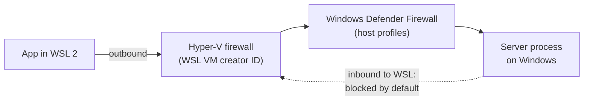

An app running inside WSL 2 (an Electron dev build, a Node process, a browser in WSLg) often needs to reach a server process running on the **Windows** side - a local backend, a device server, a database. That direction is the awkward one: Windows reaching into WSL works out of the box, WSL reaching out to Windows does not.

The symptom in the app is a bare `net::ERR_CONNECTION_REFUSED` / `TypeError: Failed to fetch` against an address that responds perfectly from a Windows browser.

## First: which networking mode is actually running

The mode declared in `%UserProfile%\.wslconfig` is not necessarily the mode in effect - the file is read only when the WSL VM boots.

```bash
ip -4 addr show | grep -E '^[0-9]+:|inet '
```

- **NAT mode** (the default): an `eth0` with a private `172.x` address on its own subnet, and a default route pointing at a gateway that is not any of the Windows addresses.
- **Mirrored mode**: the Windows interfaces appear verbatim - the same interface name and the same IP address Windows itself has.

A `nameserver 10.255.255.254` in `/etc/resolv.conf` is not evidence of NAT mode; that address is DNS tunneling, which is on by default in both modes.

## Mirrored mode: the missing flag is `hostAddressLoopback`

Mirrored mode mirrors the host's interfaces into Linux, and Microsoft's [mirrored mode documentation](https://learn.microsoft.com/en-us/windows/wsl/networking) lists "connect to Windows servers from within Linux using the localhost address `127.0.0.1`" as one of its benefits. The catch: only `127.0.0.1` works that way by default. A connection to the host's _own LAN address_ is handled by the Linux network stack, finds no Linux listener there, and is rejected - hence `ERR_CONNECTION_REFUSED` rather than a timeout.

The [`hostAddressLoopback` setting](https://learn.microsoft.com/en-us/windows/wsl/wsl-config) is what extends that behaviour to the rest of the host's addresses: when true it "will allow the Container to connect to the Host, or the Host to connect to the Container, by an IP address that's assigned to the Host". It is `[experimental]`, defaults to `false`, applies only when `networkingMode=mirrored`, needs Windows 11 22H2 or higher, and supports IPv4 only.

```ini
[wsl2]
networkingMode=mirrored

[experimental]
hostAddressLoopback=true
```

Then, from Windows:

```
wsl --shutdown
```

`.wslconfig` changes need a full VM restart, and the docs warn about an 8-second settling period before relaunching - `wsl --list --running` reporting no distributions is the reliable signal.

Verify from a fresh WSL shell, with no HTTP client involved:

```bash
cat < /dev/null > /dev/tcp/<host-ip>/<port> && echo OPEN
```

## Confirm the server is listening where you think it is

Worth ruling out before blaming WSL. From WSL you can query the Windows stack directly:

```bash
/mnt/c/Windows/System32/netstat.exe -ano | grep <port>
```

A listener on `0.0.0.0:<port>` accepts connections on every host address. A listener on `127.0.0.1:<port>` accepts only Windows-local traffic, and no WSL setting will change that - the server itself has to be rebound.

## Firewall layers

Two independent firewalls sit in this path, and they guard opposite directions.



- **Hyper-V firewall** is on by default for WSL 2 on Windows 11 22H2 with WSL 2.0.9 and higher, and its default inbound action is `Block`. That governs traffic _into_ the WSL VM, so it is the thing to change when Windows cannot reach a server inside WSL - not this scenario.
- **Windows Defender Firewall** on the host governs traffic arriving at the Windows server. If the connection still fails after the restart, an inbound allow rule for the port is the next thing to add (admin PowerShell):

  ```powershell
  New-NetFirewallRule -DisplayName "My server 8443" -Direction Inbound -Protocol TCP -LocalPort 8443 -Action Allow
  ```

  This opens the port to the LAN, not only to WSL. Decide that deliberately.

WSL's `firewall` key in `[wsl2]` (default `true`) is the master switch for both layers filtering WSL traffic. Turning it off is a diagnostic, not a fix.

## When mirrored mode simply will not connect

There is an open defect worth knowing about before spending an evening on it. In [WSL issue 40343](https://github.com/microsoft/WSL/issues/40343), a WSL-to-Windows TCP handshake in mirrored mode fails because Windows returns the SYN-ACK from a different ephemeral port than the SYN was sent to; the Linux kernel cannot match it to the open socket and answers with RST. The report covers WSL 2.6.3.0 on kernel 6.6.87.2 and states that `hostAddressLoopback=true` does not help. [Issue 12399](https://github.com/microsoft/WSL/issues/12399) describes the same one-way asymmetry with a plain `python -m http.server`, unresolved.

Both surface as `ERR_CONNECTION_REFUSED`, indistinguishable from the missing-flag case. Set the flag first, restart, and test - if a raw `/dev/tcp` probe still refuses while `netstat` shows a `0.0.0.0` listener and no firewall rule is in the way, the defect rather than the configuration is the likely cause.

The fallback is NAT mode, where the mechanism is older and better behaved: the Windows host is reachable at the default-route gateway, which the [WSL networking docs](https://learn.microsoft.com/en-us/windows/wsl/networking) obtain with

```bash
ip route show | grep -i default | awk '{ print $3}'
```

The server must be bound to `0.0.0.0` (a NAT-mode connection arrives looking like a LAN connection), and the address changes on every WSL restart, so it belongs in an environment variable rather than in a committed config file.

## Which knob for which direction

| Goal                                     | Mechanism                                                             |
| ---------------------------------------- | --------------------------------------------------------------------- |
| WSL app to Windows server, mirrored mode | `hostAddressLoopback=true`, plus host inbound firewall rule if needed |
| WSL app to Windows server, NAT mode      | Default-route gateway address, server bound to `0.0.0.0`              |
| Windows to WSL server                    | Works by default via `localhost`                                      |
| LAN to WSL server, NAT mode              | `netsh interface portproxy` forwarding to `wsl hostname -I`           |
| LAN to WSL server, mirrored mode         | Direct, once a Hyper-V firewall inbound rule allows it                |
| Linux needs a port Windows already uses  | `ignoredPorts` in `[experimental]`, mirrored mode only                |

Related: [[wsl-windows-setup]], [[development-in-wsl]]
