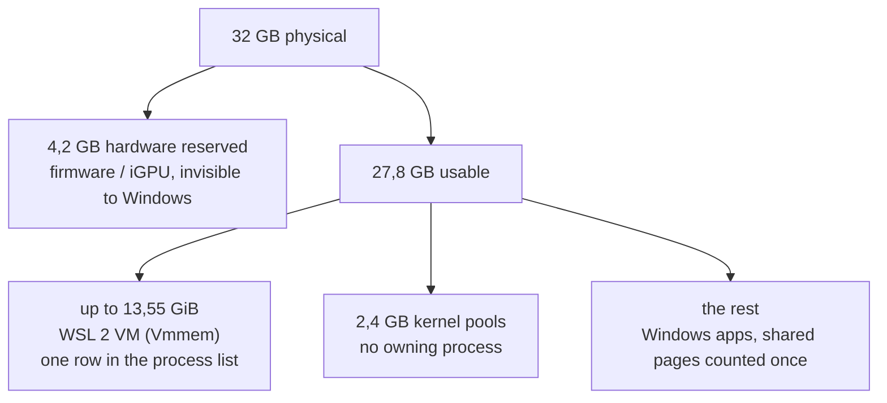

Task Manager reports 26,2 GB in use on a 32 GB machine, 1,6 GB available, and a Committed line reading 46,1/69,8 GB. The Processes tab, sorted by Memory, sums to nowhere near 26 GB. Nothing there is lying; three of those numbers measure different things, and the biggest single consumer does not appear in the process list as itself.

## What each number means

**In use** is physical RAM occupied right now. This is the number that matters when the machine starts to feel slow.

**Committed** is not RAM. It is the commit charge over the commit limit - the total virtual memory Windows has guaranteed to processes, against the maximum it could guarantee. The limit is RAM plus pagefile, so `46,1/69,8 GB` on a 32 GB machine says the pagefile is carrying most of that headroom. Pavel Yosifovich's [walk through the Memory view](https://scorpiosoftware.net/2023/04/12/memory-information-in-task-manager/) puts it as "how much memory I can totally commit on the system, regardless of whether it's in physical memory now or not". A process can commit an address range and never touch it; Chromium and V8 do this heavily, one reservation per renderer. A commit charge well above RAM is normal and is not by itself a problem.

**Hardware reserved** is RAM the operating system never sees. Firmware hands it to devices before Windows boots, and an integrated GPU taking system RAM as video memory is [the usual reason it runs to gigabytes](https://www.makeuseof.com/what-is-hardware-reserved-memory-windows/) rather than the few hundred megabytes a discrete-GPU machine shows.

## Why the Processes tab does not add up

The default Memory column is the active private working set, which Yosifovich calls out as the misleading one - he recommends adding the **Commit Size** column instead. Three further things are missing from any per-process sum:

- **Shared pages count once, for one process.** A dozen Electron and Chromium processes sharing the same mapped binaries and fonts report a fraction of what they collectively hold.
- **Kernel pools belong to no process.** Paged pool and non-paged pool are driver and kernel allocations; on the machine above they were 1004 MB and 1,4 GB, so 2,4 GB with no owner in the list.
- **Hardware reserved was never counted.** It is not memory Windows allocated, so nothing can attribute it.

## The WSL 2 VM is the part people miss

WSL 2 is a virtual machine. Everything inside it - the distro, every process in it, its page cache, and WSLg - is one `Vmmem` / `VmmemWSL` entry from the Windows side. Its size is not a fraction of what the Linux processes are using; it is whatever the VM was told it could have.

The default is generous. Microsoft's [advanced settings reference](https://learn.microsoft.com/en-us/windows/wsl/wsl-config) gives `memory` a default of "50% of total memory on Windows" and `swap` a default of "25% of memory size on Windows rounded up to the nearest GB". Fifty per cent is of what Windows can see, so hardware reserved comes off the top first.

A worked example from a 32 GB laptop with soldered LPDDR5 and an integrated GPU:

| reading                       | value     | where it comes from                            |
| ----------------------------- | --------- | ---------------------------------------------- |
| physical RAM                  | 32 GB     | -                                              |
| hardware reserved             | 4,2 GB    | Task Manager, Performance, Memory              |
| usable by Windows             | 27,8 GB   | 32 - 4,2                                       |
| VM ceiling                    | 13,55 GiB | `MemTotal` in `/proc/meminfo`, = 48,7% of 27,8 |
| in use inside the VM          | 8,3 GiB   | `free -h`                                      |
| anonymous pages inside the VM | 7,55 GiB  | `AnonPages` in `/proc/meminfo`                 |
| page cache inside the VM      | 2,8 GiB   | `free -h`, buff/cache                          |
| paged + non-paged pool        | 2,4 GB    | Task Manager                                   |



Two details decide how much of that ceiling is actually stuck:

- **Only cached memory is reclaimable.** The `autoMemoryReclaim` feature was introduced in [WSL 2.0.0](https://github.com/microsoft/WSL/releases/tag/2.0.0) as something that "makes the WSL VM shrink in memory as you use it by reclaiming cached memory". Cached. The 7,55 GiB of anonymous pages above - heap belonging to node, language servers, bundlers - is not cache and no reclaim mode touches it.
- **Reclaim is already on.** This is the trap. `autoMemoryReclaim` is still listed under `[experimental]`, which makes it look opt-in, but the documented default is now `dropCache`: "If the value is `dropCache` or an unknown value, cached memory will be reclaimed immediately." Writing `autoMemoryReclaim=gradual` into a config that did not have it makes reclaim **slower than it already was**. It is a downgrade dressed as a fix.

So the lever that changes anything is `memory`, not the reclaim mode.

## Measure first

Inside the distro:

```bash
free -h
grep -E 'MemTotal|AnonPages|Committed_AS' /proc/meminfo
ps -eo rss,pid,comm --sort=-rss | head -20
```

`MemTotal` is the ceiling the VM was given. `AnonPages` is the part that will not be reclaimed. The `ps` list names what is holding it - typically language servers, bundlers and long-lived agent processes.

From Windows PowerShell:

```powershell
Get-Process vmmem* | Select Name,@{n='GB';e={[math]::Round($_.WorkingSet64/1GB,2)}}
```

Run this twice: once right after a heavy build, once after fifteen minutes of idle. If the number falls, reclaim is working and the ceiling is the only thing left to change. If it does not fall, the memory is anonymous, not cache.

Both commands are needed. A WSL shell cannot read the Windows side when it runs under a sandbox that blocks interop, and a sandboxed shell in its own PID namespace sees only its own processes - `ls /proc` returning five entries means the `ps` output above is not the whole VM.

## Fix it in iterations

One change per `wsl --shutdown`, or nothing tells you which one worked. The config file is `%UserProfile%\.wslconfig`; it does not exist by default and the whole file is ignored if the markup is malformed. Changes need the VM to stop, and the docs warn about [the eight second rule](https://learn.microsoft.com/en-us/windows/wsl/wsl-config) - the subsystem can still be running after the last shell closes, so `wsl --shutdown` is the reliable way rather than closing windows.

### 1 - Cap the VM

```ini
[wsl2]
memory=12GB
```

Pick a cap above the peak measured above, not a round number picked by feel. A ceiling below what the workload actually wants trades a Windows problem for a Linux one.

Verify after restart with `grep MemTotal /proc/meminfo`.

### 2 - Reclaim mode, only if the VM refuses to shrink

Leave this alone unless step 1's before/after `Vmmem` comparison showed no drop. The default is already the aggressive mode, so the only sensible edit here is the opposite direction - `gradual` if `dropCache` is costing too much re-reading of dropped cache during active work, `disabled` if reclaim is causing the hang described below.

### 3 - Swap, deliberately

Omitting `swap` does not disable it; the default is 25% of `memory`, so a 12 GB cap silently creates a 3 GB swap VHD. The documented way to turn it off is `swap=0` - the reference lists the value as "0 for no swap file". Worth knowing before doing it: that swap is a Linux swapfile inside the VM at `%Temp%\swap.vhdx`, so it costs disk and not RAM, and with a hard `memory` cap and no swap, an over-cap allocation goes to the Linux OOM killer rather than spilling. It kills the largest process without warning, which will be a language server or a bundler.

### 4 - Hardware reserved

Separate problem, and no `.wslconfig` setting touches it. Normal is a few hundred megabytes. Several gigabytes usually means an integrated GPU frame buffer sized in firmware, so the BIOS UMA or shared-memory setting is the place to look. Check first whether a stale boot value is doing it instead:

```powershell
bcdedit /enum | findstr /i "removememory truncatememory"
```

A `Maximum memory` box left checked under msconfig, Boot, Advanced does the same thing and is [the easier one to rule out](https://www.thewindowsclub.com/hardware-reserved-memory-too-high).

## Caveats

**`gradual` hangs with systemd.** [WSL issue 10675](https://github.com/microsoft/WSL/issues/10675), open, reports commands stalling with `autoMemoryReclaim=gradual` when the distro has systemd enabled: "this command may hangs for a very long time. After kernel re-allocating buff/cache memory, everything works again." `sudo apt update` and `systemctl status` are the reported victims. If `/etc/wsl.conf` has `systemd=true`, this applies.

**`sparseVhd` does not touch an existing disk.** The setting reads "any newly created VHD will be set to sparse automatically". An `ext4.vhdx` that already grew - and it only ever grows, since [WSL resizes it up to meet storage needs](https://learn.microsoft.com/en-us/windows/wsl/disk-space) and never back down - needs the one-time command added in WSL 2.0.0, `wsl --manage <distro_name> --set-sparse`, after a shutdown. This recovers disk, not RAM.

**A VS Code or Electron workflow pays on both sides.** Only the server half of VS Code runs in the distro; the window itself is an Electron process on Windows. A Linux-launched Electron app renders through WSLg, which is a second VM component alongside the distro and lands in the same `Vmmem` figure.

Related: [[development-in-wsl]], [[wsl-windows-setup]], [[claude-code-wsl-only-setup]]
