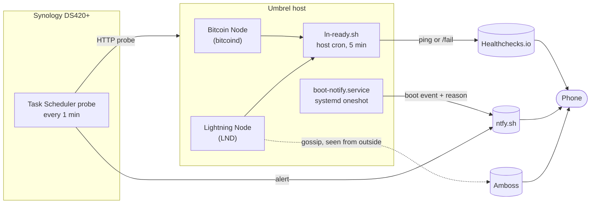

# Plan: monitoring an Umbrel Bitcoin + Lightning node

> **Status: not implemented.** Nothing in this plan has been installed or configured yet. Every
> command below is proposed work.

- **repo / branch:** `important` / `main`
- **session id:** 49822ed7-b3ac-4e19-afc6-3a1b75a01f55
- **date:** 2026-09-18
- **scope:** one Umbrel host, one Synology NAS, one consumer router

🙋 This file sits at the repository root of a repo published to GitHub. Every credential in it is a
placeholder (`<your-uuid>`, `<your-topic>`, `192.168.0.x`). Substitute real values only on the target
machines, never in this file.

## Goal

Know, within minutes and on a phone, whether the Lightning node can actually complete a payment, and
know when the Umbrel host has restarted on its own.

Two distinct questions, often confused:

- **Liveness.** Is the machine reachable and running?
- **Readiness.** Can the node send and receive sats right now?

The second is the real requirement. The first is a subset of it.

## Problem classification

A node can pass every liveness probe and still refuse to transact. These are the states that matter
and the reason a plain uptime check is insufficient.

| Failure mode | Host up? | HTTP answers? | Can transact? |
| --- | --- | --- | --- |
| LND wallet locked after a crash-restart | yes | yes | **no** |
| `bitcoind` still in initial block download or behind tip | yes | yes | **no** |
| Channel graph stale (`synced_to_graph: false`) | yes | yes | **no** |
| Zero active channels (peers offline or channels disabled) | yes | yes | **no** |
| No outbound liquidity, all balance remote | yes | yes | receive only |
| Tor circuit dead, node invisible from outside | yes | yes (on LAN) | **no** |
| Kernel panic, OOM kill, disk failure | **no** | no | no |
| Short self-reboot, 60 to 120 seconds | briefly no | briefly no | briefly no |

LND does not persist its wallet password, so the wallet needs unlocking after every restart. Since
v0.13.0-beta it can auto-unlock from a file. See
[Wallet Management, LND Builder's Guide](https://docs.lightning.engineering/lightning-network-tools/lnd/wallet).
Locked-wallet reports are common on Umbrel, for example
[this community thread](https://community.umbrel.com/t/unable-to-get-lnd-information-wallet-locked/23312).

### Why this is a money question, not a comfort question

If the node stays offline, a channel peer can only wait or force close. A force close costs on-chain
fees and locks funds for the CSV delay. Alert latency is therefore a financial parameter. See
[LND recovery docs](https://github.com/lightningnetwork/lnd/blob/master/docs/recovery.md) on the
limits of a static channel backup, and note that `channel.backup` closes channels on restore rather
than resuming them.

## Hardware and constraints

| Device | Detail | Constraint it imposes |
| --- | --- | --- |
| Umbrel host | 4 threads, 3,97 GB RAM, 1,97 TB storage (471 GB used) | No room for Prometheus, Grafana and Netdata on top of `bitcoind` and LND |
| Synology DS420+ | Intel Celeron J4025, 2 GB RAM, DSM 7 | Container Manager runs but is tight; native Task Scheduler costs nothing |
| TP-Link Archer AX73 / AX72 | Broadcom SoC, stock firmware | No scripting host at all, see [Abandoned](#abandoned) item 1 |

The DS420+ has 2 GB soldered plus one DDR4 SO-DIMM slot, 6 GB official maximum. See the
[DS420+ datasheet](https://global.download.synology.com/download/Document/Hardware/DataSheet/DiskStation/20-year/DS420+/enu/Synology_DS420_Plus_Data_Sheet_enu.pdf).

## Target architecture

Four independent layers. No layer is a superset of another, and each covers a failure the others
cannot see.



### Coverage matrix

| Failure | L1 readiness gate | L2 NAS probe | L3 boot notify | L4 Amboss |
| --- | --- | --- | --- | --- |
| Wallet locked | **yes** | no | no | after a delay |
| Not synced to chain | **yes** | no | no | no |
| Graph stale | **yes** | no | no | no |
| No active channels | **yes** | no | no | **yes** |
| No outbound liquidity | **yes** (optional check) | no | no | no |
| Host hung, network stack alive | after 5 min | **yes, 1 min** | no | after a delay |
| Host dead | **yes** | **yes** | on return | **yes** |
| Short self-reboot | maybe missed | maybe missed | **yes** | no |
| Tor unreachable from outside | no | no | no | **yes** |

## Solution

### Layer 1 - readiness gate (primary)

Invert the dead man's switch. The heartbeat fires **only when the node can transact**. One check
covers every readiness failure, and the failure reason travels with the alert.

Healthchecks.io supports an explicit `/fail` suffix that both alerts immediately and records a
payload. See [Signaling failures](https://healthchecks.io/docs/signaling_failures/) and
[Monitor shell scripts](https://healthchecks.io/docs/bash/). The free Hobbyist plan covers 20 checks,
see [Plans and Pricing](https://healthchecks.io/pricing/).

The field names used below are from the LND `GetInfo` response: `synced_to_chain`,
`synced_to_graph`, `num_active_channels`, `num_peers`, `block_height`. See the
[GetInfo API reference](https://lightning.engineering/api-docs/api/lnd/lightning/get-info/index.html).

`/home/umbrel/ln-ready.sh`:

```sh
#!/bin/sh
PING=https://hc-ping.com/<your-uuid>
LND=<lnd-container-name>

fail() {
  curl -fsS -m 10 --retry 3 --data-raw "$1" "$PING/fail" >/dev/null
  exit 0
}

INFO=$(docker exec "$LND" lncli getinfo 2>/dev/null) \
  || fail "lncli unreachable - wallet locked or container down"

echo "$INFO" | grep -q '"synced_to_chain": *true' || fail "not synced to chain"
echo "$INFO" | grep -q '"synced_to_graph": *true' || fail "graph not synced"

ACTIVE=$(echo "$INFO" | grep -o '"num_active_channels": *[0-9]*' | grep -o '[0-9]*$')
[ "${ACTIVE:-0}" -gt 0 ] || fail "no active channels"

curl -fsS -m 10 --retry 3 --data-raw "ready, active channels: $ACTIVE" "$PING" >/dev/null
```

The `--retry 3` and `-m 10` flags follow the
[Healthchecks reliability tips](https://healthchecks.io/docs/reliability_tips/).

Optional extension once the basics pass: gate on outbound liquidity with
`docker exec "$LND" lncli channelbalance` and compare `local_balance.sat` against the smallest
payment that must succeed.

Bitcoin Core exposes `initialblockdownload` and `verificationprogress` through `getblockchaininfo`,
useful as a second, more precise sync signal. See the
[getblockchaininfo RPC docs](https://bitcoincore.org/en/doc/29.0.0/rpc/blockchain/getblockchaininfo/).

### Layer 2 - NAS probe (external liveness)

Runs off the monitored box, so it survives the box dying. DSM Task Scheduler runs user-defined
scripts on a schedule with no extra package and no RAM cost. See
[Task Scheduler, Synology Knowledge Center](https://kb.synology.com/en-uk/DSM/help/DSM/AdminCenter/system_taskscheduler).

Control Panel, then Task Scheduler, then Create, Scheduled Task, User-defined script. Run as `root`,
daily, "continue running within the same day", every 1 minute.

```sh
#!/bin/sh
HOST=192.168.0.x
TOPIC=https://ntfy.sh/<your-topic>
FLAG=/volume1/homes/<user>/umbrel_down

if curl -fsS -m 5 -o /dev/null "http://$HOST/"; then
    if [ -f "$FLAG" ]; then
        curl -fsS -m 10 -H "Title: Umbrel back" -d "reachable again" "$TOPIC"
        rm -f "$FLAG"
    fi
else
    if [ ! -f "$FLAG" ]; then
        curl -fsS -m 10 -H "Title: Umbrel DOWN" -H "Priority: high" \
             -d "no HTTP response from $HOST" "$TOPIC"
        touch "$FLAG"
    fi
fi
```

Two deliberate choices. The probe is HTTP, not ICMP, because a hung host often still answers ping
while its services are dead. The flag file lives on `/volume1` rather than `/tmp` so a NAS reboot
does not re-fire a stale alert.

DSM's own email notification is an alternative to ntfy, configured under Control Panel, Notification.
See [Notification, Synology Knowledge Center](https://kb.synology.com/en-us/DSM/help/DSM/AdminCenter/system_notification_desc).

### Layer 3 - boot notification and persistent journal

A reboot shorter than the probe interval is invisible to layers 1 and 2. Watch the boot event
instead, and keep the evidence needed to diagnose it.

Persistent journal first. With the default `Storage=auto`, journald writes to `/run/log/journal`, a
tmpfs, so every crash erases its own evidence. See
[journald.conf](https://www.freedesktop.org/software/systemd/man/journald.conf.html).

```sh
sudo mkdir -p /var/log/journal
sudo systemd-tmpfiles --create --prefix /var/log/journal
sudo sed -i 's/^#\?SystemMaxUse=.*/SystemMaxUse=500M/' /etc/systemd/journald.conf
sudo systemctl restart systemd-journald
```

`/home/umbrel/boot-notify.sh`:

```sh
#!/bin/sh
TOPIC=https://ntfy.sh/<your-topic>
CLEAN=$(journalctl -b -1 --no-pager 2>/dev/null \
  | grep -qE 'systemd-shutdown|Reached target.*(Power-Off|Reboot)' \
  && echo clean || echo UNCLEAN)
OOM=$(journalctl -b -1 --no-pager 2>/dev/null | grep -c 'Out of memory: Killed')
LAST=$(journalctl -b -1 -n 1 --no-pager -o short-iso 2>/dev/null | tail -1)
curl -fsS -m 10 \
  -H "Title: $(hostname) booted [$CLEAN]" \
  -d "prev boot ended: $CLEAN
OOM kills: $OOM
last line: $LAST" \
  "$TOPIC"
```

`/etc/systemd/system/boot-notify.service`:

```ini
[Unit]
Description=Notify on boot
After=network-online.target
Wants=network-online.target

[Service]
Type=oneshot
RemainAfterExit=yes
ExecStart=/home/umbrel/boot-notify.sh

[Install]
WantedBy=multi-user.target
```

The `network-online.target` ordering follows
[systemd.io on running services after the network is up](https://systemd.io/NETWORK_ONLINE/).

Forensics after an `UNCLEAN` alert:

```sh
journalctl --list-boots
journalctl -b -1 -p err --no-pager
journalctl -b -1 -k --no-pager | tail -50
journalctl -b -1 --no-pager | grep -iE 'out of memory|oom-killer|panic|watchdog|thermal'
last -x reboot shutdown
```

On 3,97 GB of RAM with `bitcoind` and LND resident, the OOM killer is the first suspect.

### Layer 4 - Amboss, the outside view

Every other layer asks the node about itself. Amboss observes from the network, which is what decides
whether peers can reach and route through the node. A dead Tor circuit is invisible locally and
obvious externally.

Amboss sends notifications by Telegram, email or webhook, on events including the node going offline
and channels opening or closing. See [amboss.space](https://amboss.space/) and this
[feature overview](https://secondl1ght.site/blog/amboss-space).

### Layer 5 - event stream, optional

Balance of Satoshis connects the node to a Telegram bot that pushes routing forwards, channel opens
and closes, rebalances and received payments. LND only. See
[alexbosworth/balanceofsatoshis](https://github.com/alexbosworth/balanceofsatoshis) and the
[RaspiBolt guide](https://stadicus.github.io/raspibolt-dev/guide/bonus/lightning/balance-of-satoshis.html).

A force close arriving as a phone notification is worth more than a dashboard nobody opens.

## Implementation phases

Each phase ends with a verification step. A monitoring layer that has never fired is not yet a
monitoring layer.

### Phase 0 - discovery

```sh
ssh -t umbrel@umbrel.local
docker ps --format '{{.Names}}'
free -m
uptime -s
```

Record the real container names for the Bitcoin and Lightning apps. Substitute them into
`<lnd-container-name>` throughout. Terminal access is also available from the Umbrel dashboard, see
[Viewing logs](https://umbrel.com/support/troubleshooting/viewing-logs).

Reserve a static DHCP lease for the Umbrel host in the router. A changing IP would make layer 2 fire
false alarms.

### Phase 1 - persistent journal and boot notification

Apply the journald change, install `boot-notify.sh` and the unit, then:

```sh
sudo systemctl daemon-reload
sudo systemctl enable --now boot-notify.service
sudo reboot
```

**Verify:** the notification arrives with `[clean]` in the title, and `journalctl --list-boots`
returns more than one line.

### Phase 2 - readiness gate

Create the Healthchecks check with period 5 minutes and grace 10 minutes. Attach a notification
integration. Install `ln-ready.sh`, make it executable, add the cron entry:

```
*/5 * * * * /home/umbrel/ln-ready.sh
```

**Verify:** run the script by hand and confirm the check turns green. Then stop the Lightning
container and confirm the alert arrives carrying the reason text.

### Phase 3 - NAS probe

Create the DSM scheduled task and enable it.

**Verify:** shut the Umbrel host down, confirm the DOWN alert within 2 minutes, bring it back,
confirm the recovery alert.

### Phase 4 - Amboss

Create an account, claim the node, configure Telegram or email alerts.

**Verify:** confirm the dashboard shows the node as online and the alert channel accepts a test.

### Phase 5 - optional

Balance of Satoshis Telegram bot, and a decision on the NAS RAM upgrade that would unlock Beszel as a
history layer.

## Sub-issues and their solutions

1.
    - **Problem:** Wanted to review CPU and memory usage over the past 3 days after an incident.
    - **Solution:** Not recoverable. Umbrel's Live Usage panel is realtime only and covers CPU,
      memory and storage with no retention, per
      [Monitoring your Umbrel's performance](https://umbrel.com/support/basics/monitoring-your-umbrels-performance).
      Scope changed from recovering history to recording it from now on.

2.
    - **Problem:** umbrelOS exposes no network throughput metric at all, unlike Windows Task Manager.
    - **Solution:** Confirmed absent from the official UI and from the app store's built-in panels.
      Candidates were Beszel, Netdata and vnstat. Descoped once the goal moved to node readiness.

3.
    - **Problem:** 3,97 GB of RAM shared with `bitcoind` and LND rules out the usual stack.
    - **Solution:** Chose 60-second resolution over per-second, which makes Beszel's native cadence
      sufficient and makes Netdata's cost unjustifiable. Netdata's footprint is documented at
      [RAM utilization](https://learn.netdata.cloud/docs/netdata-agent/resource-utilization/ram).

4.
    - **Problem:** Any watcher installed on the monitored host is blind to that host dying.
    - **Solution:** Split into an outbound heartbeat, which needs no inbound exposure, plus an
      off-box probe on the NAS.

5.
    - **Problem:** Considered hosting the watcher on the router.
    - **Solution:** Identified the model as a TP-Link Archer AX73 / AX72 and ruled the route out on
      three independent grounds. Recorded as [Abandoned](#abandoned) item 1.

6.
    - **Problem:** Power-cut alerts are unwanted noise; the requirement is detecting the host's own
      failures.
    - **Solution:** Reframed around the boot event. A 90-second self-reboot is invisible to a
      5-minute heartbeat but always resets uptime, so a boot-time systemd unit is the correct
      instrument.

7.
    - **Problem:** Every liveness check can be green while the Lightning node cannot pay.
    - **Solution:** Readiness gate on `lncli getinfo`, asserting `synced_to_chain`, `synced_to_graph`
      and a non-zero active channel count before the heartbeat fires.

8.
    - **Problem:** A silent heartbeat says something broke but not what.
    - **Solution:** Healthchecks' `/fail` endpoint accepts a payload, so the failing condition is
      carried in the alert itself.

9.
    - **Problem:** No local check can tell whether peers can actually reach the node over Tor.
    - **Solution:** Added Amboss as an external vantage point. This is the only layer that observes
      the node the way the network does.

10.
    - **Problem:** The DS420+ has 2 GB of RAM, so Container Manager plus a monitoring hub is tight.
    - **Solution:** Chose DSM Task Scheduler, which costs no RAM, over a containerised watcher. The
      container route stays open behind a 4 GB SO-DIMM upgrade.

## Follow-ups

- `[question]` Is the node LND (Umbrel's [Lightning Node app](https://apps.umbrel.com/app/lightning),
  which is [powered by LND](https://github.com/getumbrel/umbrel-lightning)) or
  [Core Lightning](https://apps.umbrel.com/app/core-lightning)? Every script here assumes LND and
  `lncli`.
- `[action]` Run `docker ps --format '{{.Names}}'` and substitute the real container names into
  `ln-ready.sh`.
- `[action]` Decide the minimum outbound liquidity that counts as ready, then add the
  `lncli channelbalance` assertion.
- `[action]` Verify `boot-notify.service` still exists and is enabled after the next umbrelOS
  update, since `/etc/systemd/system/` is outside `/home/umbrel`.
- `[action]` Verify the host crontab entry survives an umbrelOS update, same reason.
- `[action]` Induce each failure once and confirm the matching alert arrives.
- `[question]` Buy the 4 GB SO-DIMM for the DS420+? That unlocks Beszel as a metrics-history layer
  and replaces the descoped work in sub-issue 2.
- `[action]` Confirm `channel.backup` is copied off the Umbrel host automatically, and record where.
- `[question]` Run a watchtower? See
  [this Umbrel watchtower guide](https://bitcoinmagazine.com/guides/how-to-set-up-watchtower-lightning-node).
  It reduces penalty risk, not force-close risk.
- `[action]` Decide the retention and alert threshold for a second Healthchecks check if the
  Bitcoin sync state is split out from the Lightning readiness gate.

## Suggested skills

none

## Abandoned

1. `[considered]` Hosting the watcher on the TP-Link Archer AX73 / AX72. The SoC is Broadcom with no
   OpenWrt support, see [openwrt issue #10424](https://github.com/openwrt/openwrt/issues/10424) and
   [this AX72 forum thread](https://forum.openwrt.org/t/is-archer-ax72-supported-by-openwrt/157454);
   the stock firmware offers no SSH or cron; and the Tether app's
   [New Device Alert](https://www.tp-link.com/us/support/faq/2916/) fires on join only, with
   [offline notification still an open request](https://community.tp-link.com/en/home/forum/topic/652408).
2. `[considered]` Netdata. Correct feature set and the closest visual match to Task Manager, but 200
   to 500 MB of RAM. Trimming via `[db] update every = 60` and `[ml] enabled = no`, per the
   [optimization guide](https://learn.netdata.cloud/docs/netdata-agent/configuration/how-to-optimize-the-netdata-agent-s-performance),
   still lands around ten times Beszel's cost for the same data.
3. `[considered]` [Grafana from the Umbrel store](https://apps.umbrel.com/app/grafana) on its own. It
   ships no data source, so it records nothing by itself.
4. `[considered]` Prometheus plus node_exporter plus Grafana. Worst RAM per metric of the options
   evaluated at 60-second resolution.
5. `[considered]` Zabbix. Enterprise scope and footprint for a single host.
6. `[considered]` MySpeed. Measures line speed over 30 days, which is neither usage nor node health.
7. `[considered]` [Uptime Kuma](https://apps.umbrel.com/app/uptime-kuma) as the primary host-down
   watcher. It runs on the monitored box and dies with it. Still viable as an app-level checker, and
   its keyword monitor with [custom headers](https://github.com/louislam/uptime-kuma/issues/517)
   could assert `"synced_to_chain":true` against the LND REST endpoint. Not chosen, because
   `ln-ready.sh` covers the same ground without the macaroon plumbing.
8. `[considered]` A plain dead man's switch as the primary instrument. It stays green while the LND
   wallet is locked, and misses any reboot shorter than its period. Retained only in its inverted,
   readiness-gated form as layer 1.
9. `[considered]` ICMP `ping` as the NAS probe. A hung host answers ping while its services are dead.
10. `[considered]` An external HTTP monitor such as UptimeRobot. Requires exposing the Umbrel host to
    the internet, which adds attack surface for a signal the NAS already provides on the LAN.
11. `[considered]` [lndmon](https://github.com/lightninglabs/lndmon) with Prometheus and Grafana. The
    richest Lightning-specific metrics available, rejected purely on the RAM budget. Reconsider if
    the host is ever upgraded.
12. `[considered]` vnstat. Tracks network bytes per hour, day and month at a few MB, but says nothing
    about node health.
13. `[considered]` Running a Beszel hub on the Umbrel host. The hub must outlive the thing it
    watches, so it belongs on the NAS or elsewhere.
14. `[considered]` A container-based heartbeat with `--restart unless-stopped` instead of host cron.
    More durable across umbrelOS updates, but it cannot report a dead Docker daemon, and the
    readiness gate needs `docker exec` from the host anyway.
15. `[considered]` Storing the layer 2 flag file in `/tmp` on the NAS. Cleared on reboot, which
    re-fires a stale alert.
16. `[considered]` Synology's own device monitoring. DSM has no built-in host-uptime monitor for
    third-party devices; Task Scheduler plus a script is the native route.
17. `[considered]` Notifying on clean shutdown from a systemd `ExecStop` unit. The network is often
    already down at that point, so the boot-side check of the previous boot's journal is the reliable
    way to classify the restart.

## Confidence notes

Verified against primary sources and linked inline: LND `GetInfo` field names, LND wallet unlock
behaviour, Healthchecks `/fail` semantics and free-tier limits, Bitcoin Core `getblockchaininfo`
fields, DSM Task Scheduler and notification capabilities, DS420+ memory ceiling, OpenWrt support
status for the router, Umbrel Live Usage scope, and the Umbrel Lightning app being LND-based.

Not verified, and deliberately parameterised rather than guessed:

- Docker container names on this specific Umbrel install. Phase 0 discovers them.
- Whether this node runs LND or Core Lightning. Listed as an open question.
- Whether the Umbrel web UI answers on plain HTTP at port 80 for the layer 2 probe. Phase 3 verifies.
- Exact RAM figures for Beszel and the Prometheus stack. Treated as orders of magnitude, which is all
  the decision needed.

## References

- [Monitoring your Umbrel's performance](https://umbrel.com/support/basics/monitoring-your-umbrels-performance)
- [Viewing logs, umbrelOS Support](https://umbrel.com/support/troubleshooting/viewing-logs)
- [Adding a community app store](https://umbrel.com/support/apps/how-to-add-a-community-app-store)
- [getumbrel/umbrel-lightning](https://github.com/getumbrel/umbrel-lightning)
- [LND GetInfo API reference](https://lightning.engineering/api-docs/api/lnd/lightning/get-info/index.html)
- [LND wallet management](https://docs.lightning.engineering/lightning-network-tools/lnd/wallet)
- [LND recovery docs](https://github.com/lightningnetwork/lnd/blob/master/docs/recovery.md)
- [Bitcoin Core getblockchaininfo](https://bitcoincore.org/en/doc/29.0.0/rpc/blockchain/getblockchaininfo/)
- [Healthchecks signaling failures](https://healthchecks.io/docs/signaling_failures/)
- [Healthchecks reliability tips](https://healthchecks.io/docs/reliability_tips/)
- [Healthchecks pricing](https://healthchecks.io/pricing/)
- [ntfy documentation](https://docs.ntfy.sh/)
- [systemd.io, running services after the network is up](https://systemd.io/NETWORK_ONLINE/)
- [journald.conf manual](https://www.freedesktop.org/software/systemd/man/journald.conf.html)
- [Synology Task Scheduler](https://kb.synology.com/en-uk/DSM/help/DSM/AdminCenter/system_taskscheduler)
- [Synology notification settings](https://kb.synology.com/en-us/DSM/help/DSM/AdminCenter/system_notification_desc)
- [Amboss](https://amboss.space/)
- [Balance of Satoshis](https://github.com/alexbosworth/balanceofsatoshis)
- [Beszel notifications](https://beszel.dev/guide/notifications/)
- [Big Bear Umbrel community app store](https://github.com/bigbeartechworld/big-bear-umbrel)
